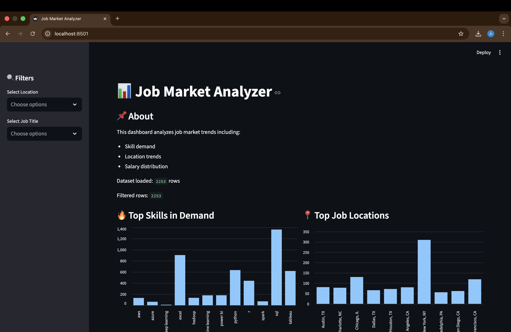
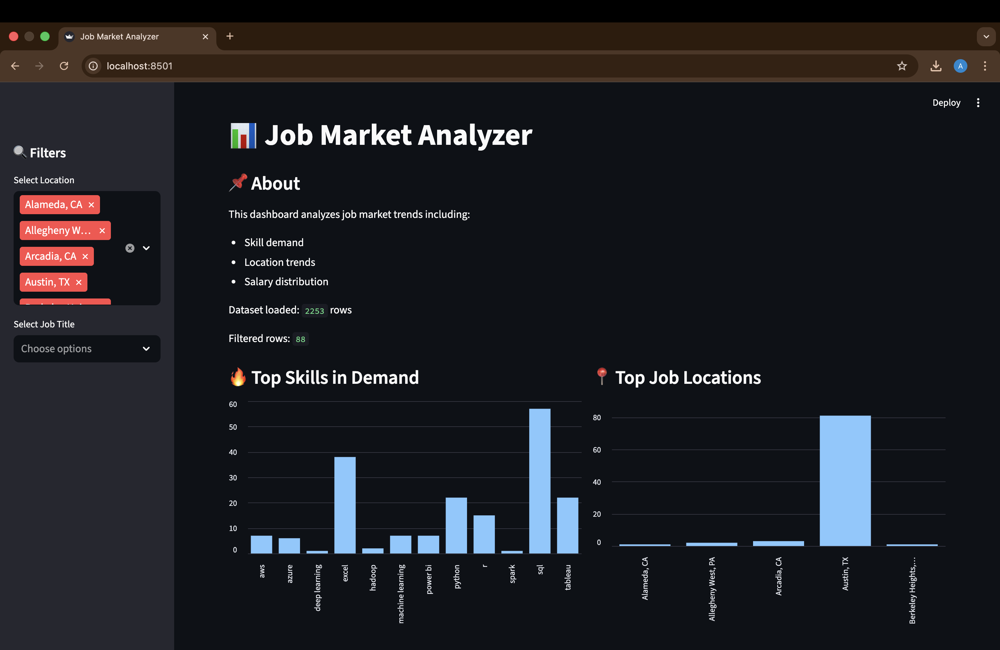
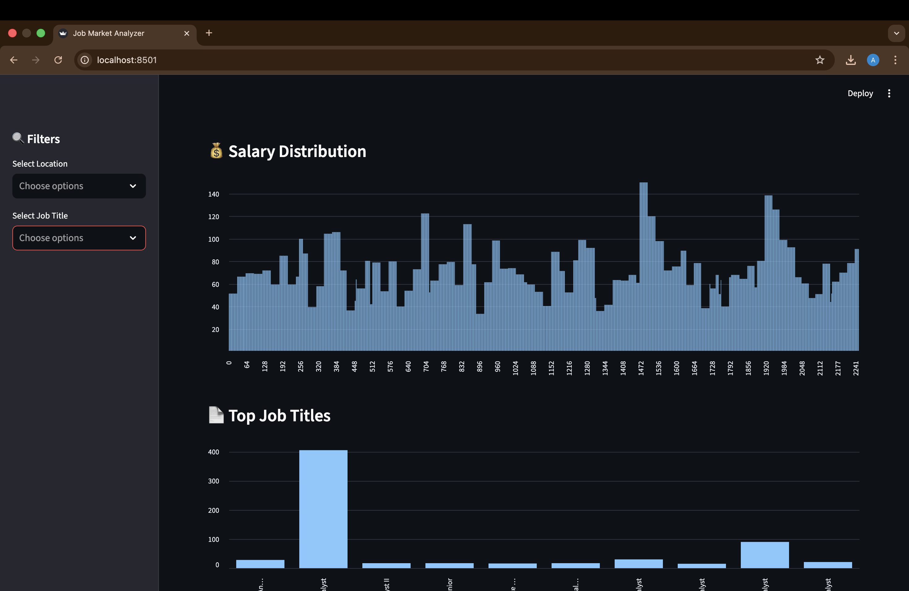
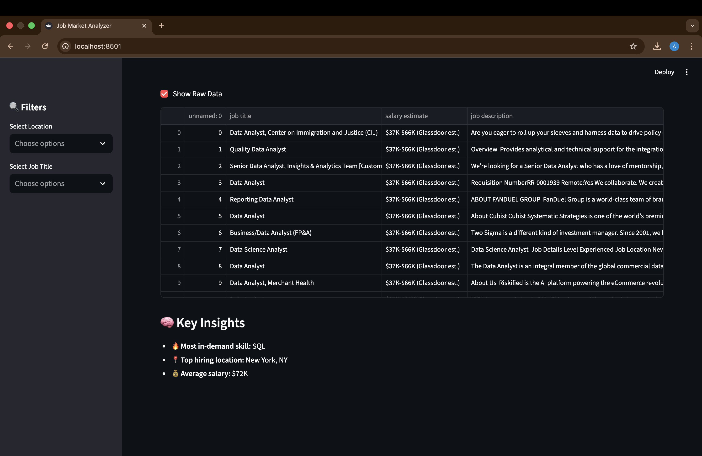

# 📊 Job Market Analyzer

An interactive data analysis project that explores job market trends using real-world job listings.  
This dashboard provides insights into **in-demand skills, job locations, and salary trends** using Python and Streamlit.

---

## 📌 Overview

This project analyzes job postings to answer key questions:

- What skills are most in demand?
- Which locations have the highest job opportunities?
- What is the salary distribution for data roles?

The results are presented through an **interactive dashboard** built with Streamlit.

---

## 🛠️ Tech Stack

- Python 🐍
- Pandas
- Matplotlib
- Streamlit
- Regex (for skill extraction)

---

## 📂 Project Structure
    # 📊 Job Market Analyzer

An interactive data analysis project that explores job market trends using real-world job listings.  
This dashboard provides insights into **in-demand skills, job locations, and salary trends** using Python and Streamlit.

---

## 📌 Overview

This project analyzes job postings to answer key questions:

- What skills are most in demand?
- Which locations have the highest job opportunities?
- What is the salary distribution for data roles?

The results are presented through an **interactive dashboard** built with Streamlit.

---

## 🛠️ Tech Stack

- Python 🐍
- Pandas
- Matplotlib
- Streamlit
- Regex (for skill extraction)

---

## 📂 Project Structure
# 📊 Job Market Analyzer

An interactive data analysis project that explores job market trends using real-world job listings.  
This dashboard provides insights into **in-demand skills, job locations, and salary trends** using Python and Streamlit.

---

## 📌 Overview

This project analyzes job postings to answer key questions:

- What skills are most in demand?
- Which locations have the highest job opportunities?
- What is the salary distribution for data roles?

The results are presented through an **interactive dashboard** built with Streamlit.

---

## 🛠️ Tech Stack

- Python 🐍
- Pandas
- Matplotlib
- Streamlit
- Regex (for skill extraction)

---

## 📂 Project Structure
---
job-market-analyzer/
│
├── data/
│ └── DataAnalyst.csv
├── notebooks/
│ └── analysis.ipynb
├── app.py
├── requirements.txt
├── README.md
└── images/

---

## 📊 Features

- 🔥 Skill demand analysis from job descriptions  
- 📍 Location-based job trends  
- 💰 Salary distribution visualization  
- 🎛️ Interactive filters (location & job title)  
- 🧠 Key insights generated dynamically  
- 📄 Raw dataset preview  

---

## 📸 Dashboard Preview

### 📊 Main Dashboard
Interactive view of skills, locations, and salary trends.

---

### 🔍 Filters in Action
Filter jobs by location and job title.

---

### 💰 Salary Distribution
Histogram showing salary trends across job postings.

---

### 🧠 Key Insights
Automatically generated insights from the dataset.

---

## 🧠 Key Insights (Example)

- 🔥 Most in-demand skill: **SQL**
- 📍 Top hiring location: **New York, NY**
- 💰 Average salary: **$72K**

---

## ▶️ How to Run the Project

### 1. Clone the repository
git clone https://github.com/yourusername/job-market-analyzer.git
cd job-market-analyzer

### 2. Create virtual environment (recommended)
python -m venv .venv
source .venv/bin/activate # Mac/Linux
### 3. Install dependencies
pip install -r requirements.txt

### 4. Run the app
python -m streamlit run app.py

### 5. Open in browser
http://localhost:8501

---

## 📊 Dataset

- Source: Kaggle (Data Analyst Job Listings)
- Contains job titles, descriptions, salary estimates, and locations

---

## 💡 Future Improvements

- Add NLP-based skill extraction (TF-IDF / NLP models)
- Deploy dashboard online (Streamlit Cloud)
- Add salary prediction model
- Improve UI with advanced visualizations

---

## 🙋‍♂️ Author

**Alvin Saju**
